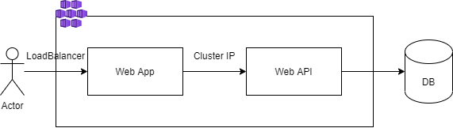
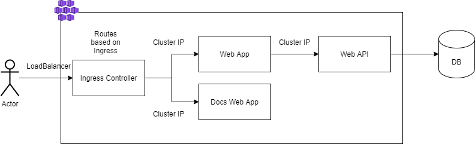

Build images

```bash
docker build -t micya/pet-webapi -f src/webapi/Dockerfile .
docker build -t micya/pet-webapp -f src/webapp/Dockerfile .
```

Deploy applications

```bash
kubectl apply -f yaml/deployment
```

Deploy services

```bash
kubectl apply -f yaml/service
```

Architecture without ingress:



Deploy another app and ingress

```bash
kubectl apply -f yaml/ingress
```

Architecture with ingress:


